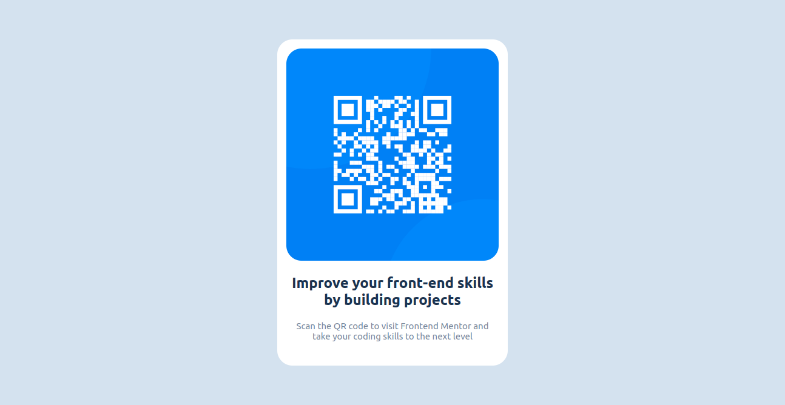

# qr-code-component-solution

# Frontend Mentor - QR code component solution

This is a solution to the [QR code component challenge on Frontend Mentor](https://www.frontendmentor.io/challenges/qr-code-component-iux_sIO_H). Frontend Mentor challenges help you improve your coding skills by building realistic projects. 

## Table of contents

- [Overview](#overview)
  - [Screenshot](#screenshot)
  - [Links](#links)
- [My process](#my-process)
  - [Built with](#built-with)
  - [What I learned](#what-i-learned)
  - [Continued development](#continued-development)
  - [Useful resources](#useful-resources)
- [Author](#author)
- [Acknowledgments](#acknowledgments)

**Note: Delete this note and update the table of contents based on what sections you keep.**

## Overview

### Screenshot

### Links

- Solution URL: [https://github.com/crystel1996/qr-code-component-solution-using-react-and-emotion](https://github.com/crystel1996/qr-code-component-solution-using-react-and-emotion)
- Live Site URL: [https://qr-code-component-solution-react.vercel.app/](https://qr-code-component-solution-react.vercel.app/)

## My process

### Built with

- Flexbox
- CSS Grid
- [React](https://reactjs.org/) - JS library
- [Emotion](https://emotion.sh/docs/introduction) - Emotion is a library designed for writing css styles with JavaScript

### What I learned

I learn how to do an unit test on React, center containers on html and css using the emotion library

## Authors

- Website - [https://crystel.vercel.app/](https://crystel.vercel.app/)
- Frontend Mentor - [@crystel1996](https://www.frontendmentor.io/profile/crystel1996)
- Linkedin - [crystel Ratsimbazafy](https://www.linkedin.com/in/crystel-ratsimbazafy-996a5417a/)
